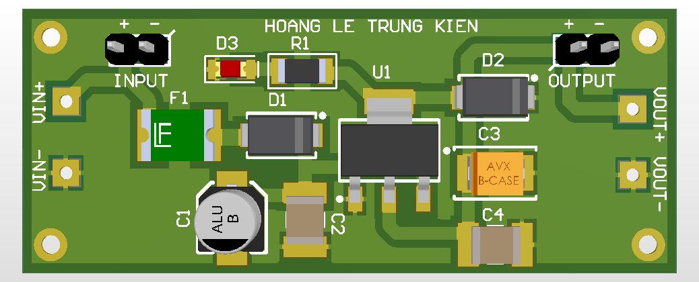

# AMS1117 LDO Module

Linear regulator breakout.

## Function
Provides stable 3.3V output.

## Key Specifications
- IC: AMS1117-3.3
- Capacitors: Input/Output filtering
- Protection: Diode

## Hardware Preview

---
Designed by HOANG LE TRUNG KIEN
